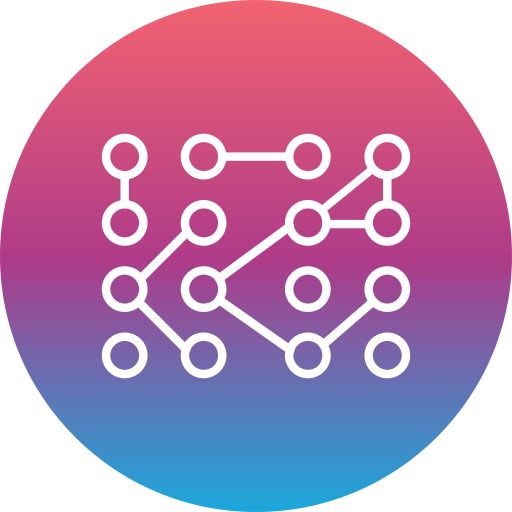
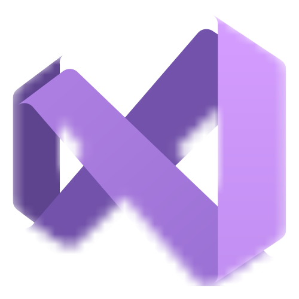

****
<!-- ALL-TOPICS-LIST:START -->
<!-- prettier-ignore-start -->
<!-- markdownlint-disable -->

<table>
  <tr>
    <td align="center"><a href="Golang"> <b>Golang</b></a></td>
    <td align="center"><a href="https://github.com/asif7707/Python-projects"> <b>Python</b></a></td>
    <td align="center"><a href="#Git"> <b>Git</b></a></td>
    <td align="center"><a href="https://github.com/asif7707/csharp-programming-for-Unity-Game-Development"> <b>Unity</b></a></td>
    <td align="center"><a href="https://github.com/asif7707/Codes/tree/main/C%23"> <b>C#</b></a></td>
  </tr>
  
   <tr>
    <td align="center"><a href="Leetcode"> <b>LeetCode</b></a></td>
    <td align="center"><a href="#GitHub"> <b>Github</b></a></td>
    <td align="center"><a href="HackerRank"> <b>HackerRank</b></a></td>
    <td align="center"><a href="C++"> <b>C++</b></a></td>
    <td align="center"><a href="codeforces"> <b>Codeforces</b></a></td>
  </tr>
  
   <tr>
    <td align="center"><a href="C program"> <b>C</b></a></td>
    <td align="center"><a href="python gfg/Python Numpy"> <b>Numpy</b></a></td>
    <td align="center"><a href="python gfg/Python Pandas"> <b>Pandas</b></a></td>
    <td align="center"><a href="Algorithms"> <b>Algorithm</b></a></td>
    <td align="center"><a href="HackerRank/HackerRank Regex Solutions"> <b>Regex</b></a></td>
  </tr>
   
</table>

<!-- markdownlint-enable -->
<!-- prettier-ignore-end -->
<!-- ALL-TOPICS-LIST:END -->

****

 

****
> ## Git 
Git is a powerful and versatile version control system (VCS) widely used in software development to track changes in code, manage different versions, and collaborate effectively.

### Key Features:

* **Version Control:** Snapshots, Branching, History
* **Collaboration:** Teamwork, Sharing, Distributed
* **Benefits:** Improved Code Quality, Increased Productivity, Enhanced Security

****
> ## GitHub

**Unite, Create, Innovate:**

GitHub is more than just a code repository; it's a vibrant platform where developers connect, collaborate, and build software together. Here's a glimpse into what makes it special.

### Key Features:

* **Version Control:** Track changes, revert to previous versions, and work with branches seamlessly.
* **Collaboration Powerhouse:** Join forces with other developers, share projects, and contribute to open-source initiatives.
* **Code Visibility:** Showcase your skills, connect with potential employers, and gain recognition within the developer community.
* **Robust Security:** Benefit from industry-standard security features, data backups, and disaster recovery.
* **Learning Hub:** Explore diverse projects, engage in insightful discussions, and continuously expand your coding knowledge.

### For Individuals:

* **Build a Portfolio:** Showcase your expertise, demonstrate your coding prowess, and attract potential employers.
* **Expand Your Knowledge:** Dive into different projects, discover new technologies, and stay updated with the latest trends.
* **Contribute & Give Back:** Share your expertise in exciting open-source projects and make a tangible impact.

### For Teams:

* **Streamline Collaboration:** Work together efficiently, track progress, and manage code releases effectively.
* **Enhanced Communication:** Discuss code, share ideas, and stay aligned using built-in communication tools.
* **Secure Code Management:** Implement access controls, security measures, and ensure the integrity of your codebase.

### Ready to Join the GitHub Community?

Create your free account today and unlock a world of possibilities:

* **Start Your Own Project:** Share your code, invite collaborators, and build something amazing.
* **Contribute to Existing Projects:** Find projects you're passionate about and lend your expertise.
* **Connect with Other Developers:** Network, learn, and grow alongside a supportive community.

### Beyond the Basics:

* **GitHub Actions:** Automate tasks, build, test, and deploy your code efficiently.
* **GitHub Pages:** Host your static websites directly on GitHub for effortless publishing.
* **Packages & Registries:** Share reusable code modules and discover valuable resources.

### Embrace the Power of GitHub:

With its multifaceted offerings, GitHub serves as a catalyst for your coding endeavors, fueling individual growth and fostering exceptional teamwork. Dive into its depths, unleash your potential, and become a part of the thriving developer ecosystem.

**Get Started Today!**

> [GitHub](https://github.com/signup)

#### Additional Resources:

* [GitHub Documentation](https://docs.github.com/)
* [GitHub Guides](https://guides.github.com/)
* [GitHub Blog](https://github.blog/)

****
